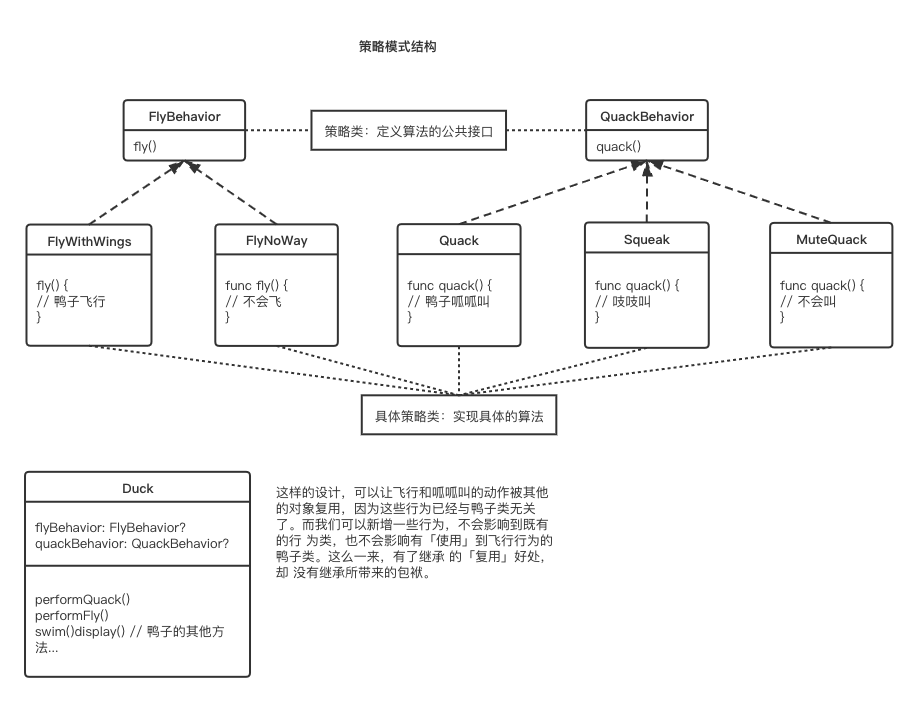
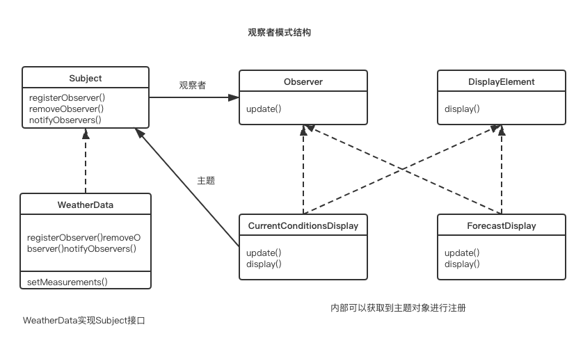

# DesignPatternForSwift

## 策略模式

策略模式定义了算法族，分别封装起来，让它们之间可以互相替换，此模式让算法的变化独立于使用算法的客户。

实现核心就是：将算法的使用和算法的实现分离。算法的实现交给策略类。算法的使用交给环境类，环境类会根据不同的情况选择合适的算法。



## 观察者模式

观察者模式定义了一系列对象之间的一对多关系。当一个对象改变状态，其他依赖者都会收到通知。

`观察者模式=主题（Subject）+订阅者（Observer）`

主题和观察者定义了一对多的关系。观察者依赖于此主题，只要主题状态一有变化，观察者就会被通知。



## 装饰者模式

装饰者模式给爱用继承的人一个全新的设计眼界。通过对象组合的方式，能够在不修改任何底层代码的情况下，赋予新的职责。

装饰者模式的角色：

**Component（抽象构件）**
Component是具体构件和抽象装饰类的共同父类，声明了在具体构件中实现的业务方法。

**ConcreteComponent（具体构件）**
它是Component的子类，实现了在抽象构件中声明的方法，是我们将要动态地加上新行为的对象。

**Decorator（抽象装饰类）**
它也是Component的子类，用于给ConcreteComponent增加职责，但是具体职责在其子类（ConcreteDecorator）中实现，另外它维护一个指向Component的引用，通过该引用可以调用ConcreteComponent的方法，并通过其子类扩展该方法，以达到装饰的目的。

**ConcreteDecorator（具体装饰类）**
它是Decorator的子类，负责向构件添加新的职责。新职责是通过在旧行为前面或后面做一些计算来添加的。


举例

```Swift
// 深度烘焙摩卡奶泡饮料
// 创建深度烘焙
var beverage2: Beverage = DrakRoast()
// 通过深烘咖啡创建摩卡
beverage2 = Mocha(beverage: beverage2)
// 加奶泡
beverage2 = Whip(beverage: beverage2)
debugPrint("\(beverage2.getDescription()), $\(beverage2.cost())" )
```


