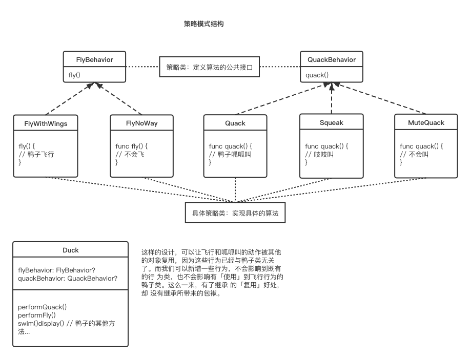

# DesignPatternForSwift

## 策略模式

策略模式定义了算法族，分别封装起来，让它们之间可以互相替换，此模式让算法的变化独立于使用算法的客户。

实现核心就是：将算法的使用和算法的实现分离。算法的实现交给策略类。算法的使用交给环境类，环境类会根据不同的情况选择合适的算法。

## 观察者模式

观察者模式定义了一系列对象之间的一对多关系。当一个对象改变状态，其他依赖者都会收到通知。

`观察者模式=主题（Subject）+订阅者（Observer）`

主题和观察者定义了一对多的关系。观察者依赖于此主题，只要主题状态一有变化，观察者就会被通知。

