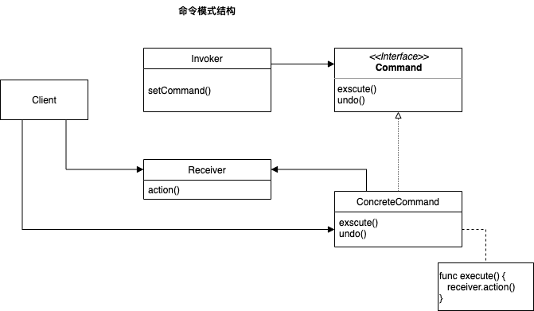
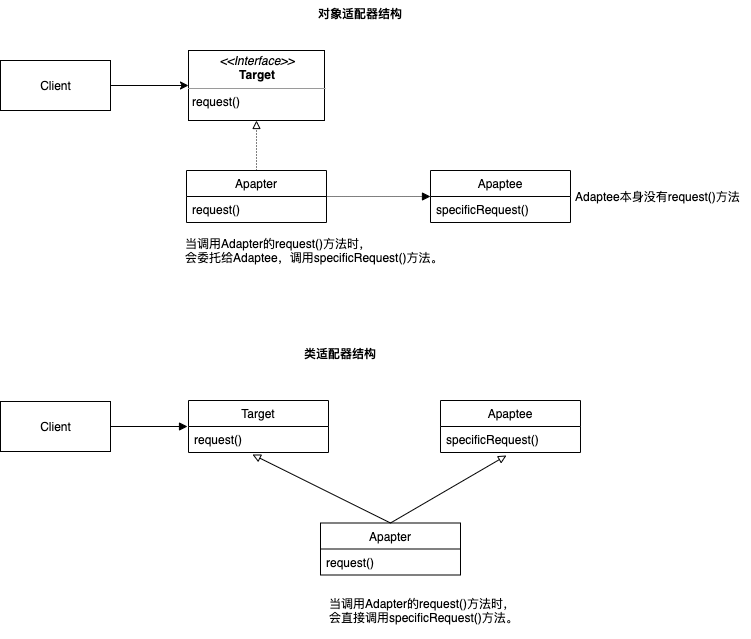

# DesignPatternForSwift

## 策略模式

策略模式定义了算法族，分别封装起来，让它们之间可以互相替换，此模式让算法的变化独立于使用算法的客户。

实现核心就是：将算法的使用和算法的实现分离。算法的实现交给策略类。算法的使用交给环境类，环境类会根据不同的情况选择合适的算法。


## 观察者模式

观察者模式定义了一系列对象之间的一对多关系。当一个对象改变状态，其他依赖者都会收到通知。

`观察者模式=主题（Subject）+订阅者（Observer）`

主题和观察者定义了一对多的关系。观察者依赖于此主题，只要主题状态一有变化，观察者就会被通知。


## 装饰者模式

装饰者模式给爱用继承的人一个全新的设计眼界。通过对象组合的方式，能够在不修改任何底层代码的情况下，赋予新的职责。

装饰者模式的角色：

+ **Component（抽象构件）**：Component是具体构件和抽象装饰类的共同父类，声明了在具体构件中实现的业务方法。
+ **ConcreteComponent（具体构件）**：它是Component的子类，实现了在抽象构件中声明的方法，是我们将要动态地加上新行为的对象。
+ **Decorator（抽象装饰类）**：它也是Component的子类，用于给ConcreteComponent增加职责，但是具体职责在其子类（ConcreteDecorator）中实现，另外它维护一个指向Component的引用，通过该引用可以调用ConcreteComponent的方法，并通过其子类扩展该方法，以达到装饰的目的。
+ **ConcreteDecorator（具体装饰类）**：它是Decorator的子类，负责向构件添加新的职责。新职责是通过在旧行为前面或后面做一些计算来添加的。


举例

```Swift
// 深度烘焙摩卡奶泡饮料
// 创建深度烘焙
var beverage2: Beverage = DrakRoast()
// 通过深烘咖啡创建摩卡
beverage2 = Mocha(beverage: beverage2)
// 加奶泡
beverage2 = Whip(beverage: beverage2)
debugPrint("\(beverage2.getDescription()), $\(beverage2.cost())" )
```

## 工厂模式

### 工厂方法
工厂方法模式定义了一个创建对象的接口，但由子类决定要实例化的类是哪一个。工厂方法让类把实例化推迟到子类。

工厂方法的角色：

+ **Creator（创建者）**：Creator是一个抽象类，它实现了所有操纵产品的方法，但是不实现工厂方法。工厂方法又子类实现。
+ **ConcreteCreator（具体创建者）**：它是Creator的子类，实现了工厂方法。ConcreteCreator负责创建一个或多个具体产品，只有它知道如何创建具体产品
+ **Product（产品）**：Product是一个类或者抽象类，用来声明产品的共同接口。
+ **ConcreteProject（具体产品）**：实际制造出的产品


### 简单工厂

知道工厂方法的角色后，简单工厂就容易理解了，就是一个ConcreteCreator持有一个简单工厂，简单工厂知道如何创建具体产品。简单工厂并不是一个设计模式，像是一种编程习惯。

### 抽象工厂

抽象工厂提供一个接口，用于创建相关或依赖的家族，而不需要确定指定具体类。抽象工厂允许客户使用抽象的接口来创建一组相关的产品，而不需要知道实际产出的具体产品是什么，因此抽象是对产品的抽象。


书中关于工厂方法和抽象工厂的区别

+ 在工厂方法中，创建者（`PizzaStore`）提供一个抽象接口来创建“一个产品“，由子类（`ChicagoPizzaStore`或`NYPizzaStore`）决定实例化哪个具体产品。
+ 在抽象工厂中，提供一个抽象接口（`PizzaIngredientFactory`）来创建一个产品家族，这些负责在抽象工厂中建立产品的方法通常是以工厂方法来实现的。每个具体子类（`NYPizzaIngredientFactory`或`ChicagoPizzaIngredientFactory`）都创建一个家族的产品。

自己关于工厂方法和抽象工厂的理解：

+ 工厂方法只能抽象出一个产品类，该产品类可以派生出多个具体产品类，该产品类就是`Pizza`，`NYStyleCheesePizza`和`ChicagoStyleCheesePizza`为具体产品类。抽象工厂有多个抽象产品类，每个抽象产品类可以派生出多个具体产品类，`CheesePizza`、`VeggiePizza`、`ClamPizza`均为抽象产品类。
+ 工厂方法的具体工厂类只能创建一个具体产品类的实例，`NYStylePizzaStore`创建cheese类产品只能是`NYStyleCheesePizza`。抽象工厂的具体工厂类可以创建多个具体产品类的实例，`NYPizzaStore`创建cheese类产品可以根据`PizzaIngredientFactory`的不同创建出不同的`CheesePizza`。

## 命令模式

命令模式将请求封装成对象，以便使用不同的请求、队列或者日志来参数化其他对象。命令模式可以支持可撤销的操作。

命令模式的角色：

+ **Client**：负责创建一个ConcreteCommand，并设置它的接受者。
+ **Invoker**：调用者持有一个命令对象，并在某个时间点调用命令对象的`execute()`方法，执行请求。
+ **Command**：为所有命令声明一个接口，调用命令对象的`execute()`方法，就可以让接收者进行相关的动作。
+ **ConcreteCommand**：定义了动作和接收者之间的绑定关系。调用者只要调用`execute()`方法就可以发出请求，然后由ConcreteCommand调用接收者的一个或多个动作。`execute()`方法会调用接收者的动作，以满足请求。
+ **Receiver**：接收者知道如何进行必要的工作，实现这个请求。任何类都可以当接收者。



举例

```Swift
// Invoker角色
let remoteControl = RemoteControl()

// Receiver角色
let light = Light(location: "Living Room")
let tv = TV(location: "Living Room")
let stereo = Stereo(location: "Living Room")
let hottub = Hottub()

// ConcreteCommand角色
let lightOn = LightOnCommand(light: light)
let stereoOn = StereoOnCommand(stereo: stereo)
let tvOn = TVOnCommand(tv: tv)
let hottubOn = HottubOnCommand(hottub: hottub)

let lightOff = LightOffCommand(light: light)
let stereoOff = StereoOffCommand(stereo: stereo)
let tvOff = TVOffCommand(tv: tv)
let hottubOff = HottubOffCommand(hottub: hottub)

let partyOn: [Command] = [lightOn, stereoOn, tvOn, hottubOn]
let partyOff: [Command] = [lightOff, stereoOff, tvOff, hottubOff]

let partyOnMacro = MacroCommand(commands: partyOn)
let partyOffMacro = MacroCommand(commands: partyOff)

// remoteControl持有上面的命令对象
remoteControl.setCommand(slot: 0, onCommand: partyOnMacro, offCommand: partyOffMacro)

print("--- Pushing Macro On ---")
// 调用onButtonWasPushed方法使得该命令的execute方法执行
remoteControl.onButtonWasPushed(slot: 0)
print("--- Pushing Macro Off ---")
remoteControl.offButtonWasPushed(slot: 0)
print("--- Pushing Macro Undo ---")
remoteControl.undoButtonWasPushed()
```

## 适配器模式

适配器模式将一个类的接口，转换成客户期望的另一个接口。适配器模式可以分成对象适配器和类适配器，区别是对象适配器使用组合的方法实现，适配器和被适配者是关联关系，类适配器则采用了继承的方式实现，适配器和被适配者是依赖关系（类适配器适用于多重继承的环境下）。



## 外观模式


